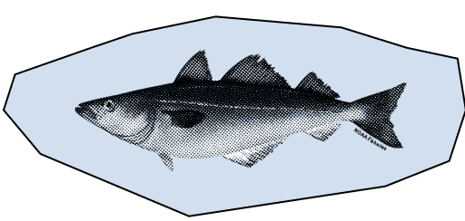

    

        

        
        
        
        
        
        
    

<form id="myform" cf-form>
    <fieldset cf-label="opening" name="cfc-opening" cf-input-placeholder="Select Seafood"
        cf-questions="Hey there, seafood adventurer!  Ready to spice up your shopping game with some local flair? Let's embark on a flavor-filled journey to discover exciting and lesser-known Massachusetts local options that keep that delicious familiarity intact!&&Let's kick things off by picking a species that tickles your taste buds or is making into your shopping list today!"
        />
        
            <input type="radio" name="cfc-opening" id="intro-{{ option.value }}" value="{{ option.value }}">
            <label for="intro-{{ option.value }}">{{ option.label }}</label>
        
    </fieldset>

    
    <fieldset type="text" name="cfc-species-{{ option.value }}"
        cf-questions="If {{ option.label }} is your jam, chances are you're into seafood with the following flavor traits...&&&&Ask the friendly counter folks for these lively Massachusetts arrivals you might just love.&&"
        cf-input-placeholder="Type anything to select another seafood"
        >
            <input type="radio"
                   cf-conditional-cfc-opening="{{ option.value }}"
                   name="cfc-species-{{ option.value }}"
                   id="species-{{ option.value }}-recipe"
                   value="{{ option.value }}-recipe"
                   cf-label="A ridiculously easy & tasty recipe for this list"
                   >

            <input type="radio"
                   cf-conditional-cfc-opening="{{ option.value }}"
                   name="cfc-species-{{ option.value }}"
                   id="species-{{ option.value }}-eco"
                   value="{{ option.value }}-eco"
                   cf-label="Dive deeper into <a href='https://www.eatingwiththeecosystem.org/' target='_blank'>Eating with the Ecosystem</a>"
                   >

            <input type="radio"
                   cf-conditional-cfc-opening="{{ option.value }}"
                   name="cfc-species-{{ option.value }}"
                   id="species-{{ option.value }}-local"
                   value="{{ option.value }}-local"
                   cf-label="Check <a href='https://www.thelocalcatch.com/' target='_blank'>the Local Catch Network</a> to locate your desired catch"
                   >
    </fieldset>
    

    
    <input
      type="text"
      cf-questions=""
      cf-conditional-cfc-species-{{ option.value }}="{{ option.value }}-recipe" />
    

</form>
